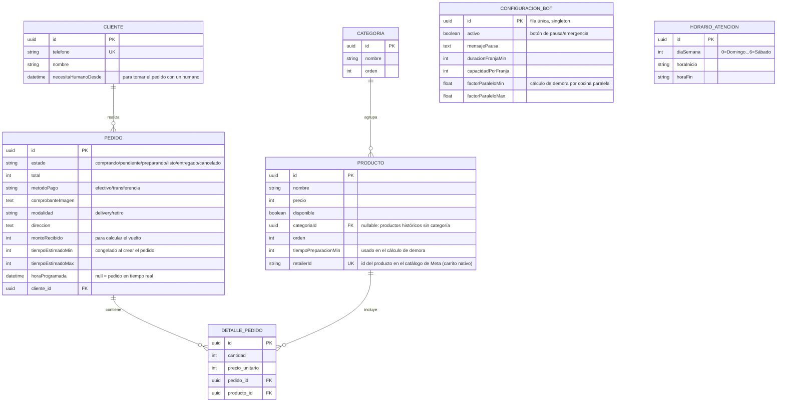

# Urban Perú — Bot de Pedidos por WhatsApp

Sistema de automatización de pedidos por WhatsApp para **Urban Perú**, un food truck de comida peruana operando en Chile. Reemplaza la toma de pedidos manual por un flujo conversacional completo: menú por categorías, modalidad de entrega, verificación de pago, agenda de pedidos fuera de horario y un dashboard en tiempo real para el negocio.

No es un proyecto de práctica — está corriendo en producción, tomando pedidos reales, para un negocio real.

**[Repositorio](https://github.com/kevynceledon-ui/UrbaPer--bot)**

---

## ✨ Características principales

- **Menú por categorías**, no una lista plana — el cliente navega por tipo de plato (ceviches, wok, pastas, etc.) en vez de escanear 20+ ítems de una vez.
- **Delivery o retiro en el local**, con reglas distintas para cada uno (aviso de "envío solo por transferencia" solo aplica a delivery; dirección del local se muestra automáticamente a quien retira).
- **Tiempo de preparación calculado, no inventado.** Cada plato tiene su propio tiempo base; un pedido de varios platos no suma los tiempos linealmente — se calcula con un factor de paralelización que refleja cómo se cocina en la práctica.
- **Cola de pedidos en tiempo real:** el tiempo que se le informa a cada cliente sube según cuántos pedidos hay activos en cocina en ese momento, con un tope máximo de 60 minutos.
- **Agenda para pedidos fuera de horario:** si alguien escribe antes de abrir, el bot ofrece horarios disponibles reales (respetando el horario real del negocio, incluyendo turno partido martes a sábado y horario especial los domingos), con cupo limitado por franja — nunca se agenda para el día siguiente.
- **Verificación de pago:** comprobante de transferencia, o captura del monto en efectivo para calcular el vuelto exacto.
- **Botón de pausa/emergencia** en el dashboard — el dueño puede desactivar el bot completo con un mensaje personalizable, para días en que el negocio no puede atender.
- **Notificación directa por WhatsApp** al número del dueño en cada pedido nuevo, además del dashboard — no depende de tener la pantalla abierta.
- **Dashboard en tiempo real** (Socket.IO) con autenticación (JWT + login), separando pedidos regulares de pedidos programados.
- **Modo de prueba aislado:** comandos `/simular` que solo responden a números de prueba autorizados, sin afectar el comportamiento real para clientes.

## 🏗️ Stack técnico

| Capa | Tecnología | Por qué |
|---|---|---|
| WhatsApp | [Baileys](https://github.com/WhiskeySockets/Baileys) (`@whiskeysockets/baileys`) **en migración hacia la [WhatsApp Business Platform Cloud API](https://developers.facebook.com/docs/whatsapp/cloud-api)**, la API oficial de Meta | El número real sigue en Baileys hoy, pero el transporte de Cloud API ya está construido y desplegado (detrás de una bandera, sin activar todavía). Motivo del cambio: Baileys no tiene respaldo oficial de Meta y expone el número real a un baneo sin aviso — riesgo que crece justo cuando el negocio tiene más pedidos. Ver "Decisiones de diseño" y el Roadmap. |
| Backend | Node.js + TypeScript + Express | Tipado en toda la lógica de negocio, que tiene bastante ramificación (modalidad, horarios, verificación de pago). |
| Base de datos | PostgreSQL + Sequelize | Modelo relacional para pedidos, productos, categorías, horarios de atención y configuración del bot. |
| Tiempo real | Socket.IO | Dashboard se actualiza al instante con cada pedido nuevo, sin polling. |
| Seguridad | Helmet, JWT, `express-rate-limit`, CORS configurado | Dashboard autenticado, no expuesto públicamente sin login. |
| Frontend (dashboard) | Desplegado en Vercel | Separado del backend, consume la API vía Socket.IO + REST. |
| Hosting | Render | La sesión de Baileys (`.baileys_auth`) vive en el filesystem del contenedor, no en un disco persistente — sobrevive a reinicios del proceso, pero no está garantizado que sobreviva a un redeploy. Es otra razón para migrar a la Cloud API: ahí la sesión la administra Meta, no depende de infraestructura de disco. |

## 📐 Decisiones de diseño destacadas

Este proyecto tiene bastante más lógica de negocio real de la que un bot de menú típico necesita. Algunas decisiones que vale la pena mencionar:

- **Baileys → Cloud API oficial de Meta, migración en curso.** Baileys fue la elección inicial (sin costo, viable para el volumen de un negocio pequeño), pero no tiene respaldo oficial de Meta y expone el número real a un baneo sin aviso previo — un riesgo que crece justo cuando el negocio tiene más pedidos, que es cuando más dolería perder el canal. Se investigó el costo real de la Cloud API contra la documentación oficial y se decidió migrar: el transporte ya está construido y validado contra un número de prueba, desplegado en producción detrás de una bandera (`WHATSAPP_TRANSPORT`), sin activar todavía sobre el número real hasta completar la validación final.
- **Fórmula de demora no es un número fijo por pedido.** Se calculó combinando el plato más lento del pedido más un factor de paralelización sobre el resto — evita tanto subestimar (varios platos "gratis") como sobrestimar (sumar tiempos como si se cocinaran en serie).
- **Máquina de estados explícita, con un único objeto de estado por cliente.** La conversación es una tabla `estado → manejador` (un manejador por paso: nombre, modalidad, método de pago, comprobante, confirmación…) y todo lo que el bot recuerda de un pedido a medio armar vive en una sola estructura por cliente que se borra de una vez. Antes eran ~10 mapas sueltos y una función de 700 líneas; esa forma producía bugs reales (datos de pago mezclados entre intentos, un `reset` que dejaba el carrito anterior colgado). La refactorización se validó con una comparación "golden master": las mismas conversaciones simuladas contra el código viejo y el nuevo, respuesta por respuesta, sin diferencias.
- **Agenda de horarios como menú cerrado, no texto libre.** El cliente nunca escribe una hora a mano — elige entre franjas ya validadas contra la capacidad real, eliminando por diseño el caso de "pedí una hora que ya estaba llena".
- **Catálogo nativo de WhatsApp Business como canal de compra real, no solo vitrina.** La integración inicial evaluada contra Baileys (`orderMessage`/`getOrderDetails`, protocolo no documentado y frágil) se descartó a propósito. Con la migración a la Cloud API, el catálogo se arma en Meta Commerce Manager (herramienta oficial de Meta) y el pedido armado ahí llega al bot como un evento de webhook normal — mismo motor de conversación que ya procesa los pedidos por código de texto, sin duplicar lógica de pago/entrega. Ver Roadmap.

## 🗂️ Modelo de datos



`ConfiguracionBot` y `HorarioAtencion` no tienen relaciones (foreign keys) hacia el resto — son configuración global del negocio (horario real, mensaje de pausa, factores de la fórmula de demora), no datos por cliente o por pedido, así que quedan intencionalmente desconectados del resto del modelo.


## 🚀 Cómo levantarlo localmente

```bash
git clone https://github.com/kevynceledon-ui/UrbaPer--bot.git
cd UrbaPer--bot
npm install
cp .env.example .env   # completar con tus propios valores
npm run dev
```

Variables de entorno principales (ver `.env.example` para la lista completa y comentada):

- `DB_URL` — conexión a PostgreSQL
- `JWT_SECRET`, `DASHBOARD_USER`, `DASHBOARD_PASSWORD` — acceso al dashboard
- `ALLOWED_ORIGINS` — CORS
- `DIRECCION_LOCAL` — se muestra automáticamente a quien elige retiro
- `NUMEROS_PRUEBA` — números autorizados para usar los comandos `/simular`

Al iniciar por primera vez, Baileys genera un código QR en consola para vincular el número de WhatsApp del negocio.

## 🗺️ Roadmap

**En curso** — migración de Baileys a la WhatsApp Business Platform Cloud API:
- Transporte Cloud API construido y validado contra un número de prueba (texto, imagen de comprobante, persistencia en base de datos).
- Catálogo nativo de WhatsApp Business (vía Meta Commerce Manager) como canal de compra real: el cliente arma su carrito en la interfaz nativa de WhatsApp, el bot recibe el pedido armado por webhook y sigue el mismo flujo de pago/entrega que ya existe.
- Corte del número real: pendiente de verificación de negocio ante Meta y de un período de validación en paralelo con Baileys antes de desactivarlo.

**Documentado, pendiente de implementación:**
- Comando `/agotado` para que el dueño marque un plato sin stock en el momento, sin depender de predicciones de demanda.
- Verificación automática de comprobantes de transferencia con un modelo de visión (detección de comprobantes reciclados, montos incorrectos), como filtro previo a revisión humana, no como reemplazo de esta.

## 👤 Sobre el desarrollo de este proyecto

Este proyecto es real: cliente real, dinero real, pedidos reales. Mi rol fue llevar los requerimientos directamente con la dueña del negocio, tomar las decisiones de arquitectura y de reglas de negocio (algunas documentadas arriba), dirigir la implementación técnica usando herramientas de IA (Claude Code), y hacer control de calidad real — varios de los ajustes de este repo salieron de bugs que encontré probando el flujo en producción, no de una checklist. Lo trato como cualquier otro proyecto de ingeniería: con las decisiones documentadas y defendibles, no como una caja negra que "simplemente funciona".

---

Kevin Celedón — [Portfolio](https://kevynceledon-ui.github.io/mi_Portafolio/) · [LinkedIn](https://www.linkedin.com/in/kevin-celedón/) · [GitHub](https://github.com/kevynceledon-ui)
